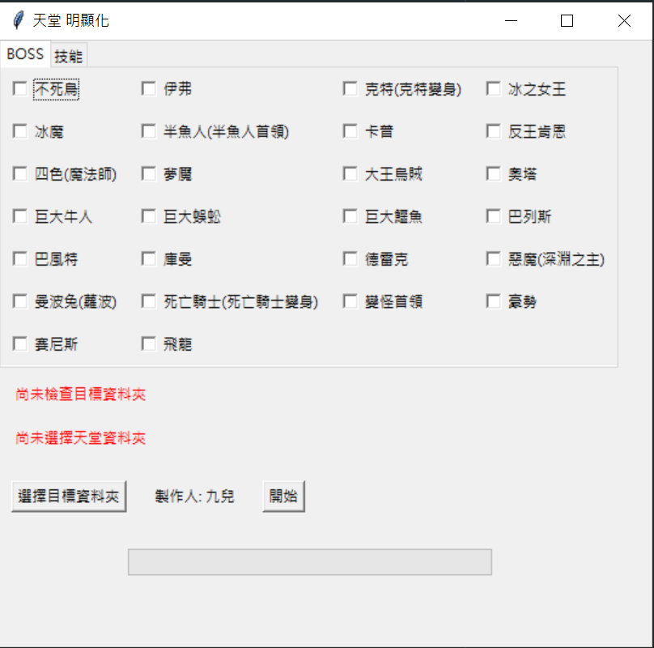
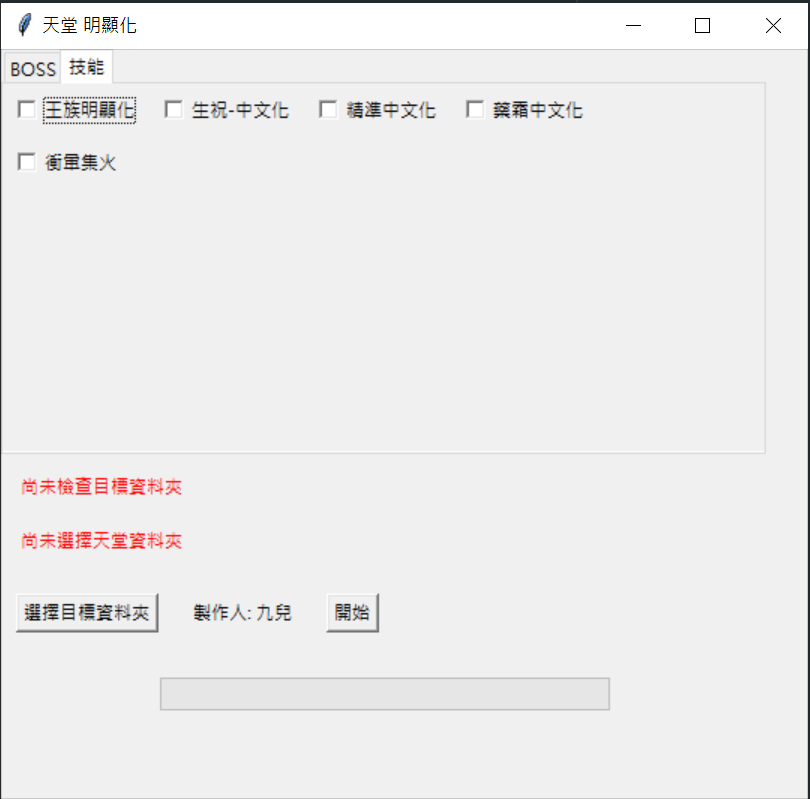

# BOSS明顯化

## 簡介
BOSS明顯化是一款便於管理和顯化 BOSS 文件的桌面工具。使用者可以選擇天堂資料夾，勾選需要顯化的 BOSS 或技能項目，程式會自動將對應檔案複製到目標資料夾中。

此版本已改用 Rust 實作，GUI 使用 `eframe/egui`，資料夾選擇使用原生系統對話框。

## Demo



## 功能
- 選擇目標天堂資料夾
- 動態掃描 `pubilc/` 或 `public/` 下的分類與項目
- 勾選需要顯化的項目
- 自動複製 `sprite/*.spr` 到目標 `sprite/`
- 自動複製 `icon/*.tbt` 到目標 `icon/`
- 檢查並在完成後執行目標資料夾內的 `eat.exe`
- 支援圖片預覽：PNG、JPG、GIF、BMP、WEBP
- GIF 預覽會自動播放

## 資料夾結構

程式啟動時會優先尋找執行檔旁的 `pubilc/`，找不到時改找 `public/`。

```text
public/
├── BOSS/
│   ├── 不死鳥/
│   │   ├── sprite/
│   │   │   └── boss.spr
│   │   └── preview.png
│   └── 伊弗/
│       └── sprite/
├── skills/
│   └── 汙水-中文化/
│       └── sprite/
└── other/
    └── 王族明顯化/
        └── icon/
            └── icon.tbt
```

## 開發

### 環境需求
- Rust 1.94+（edition 2024）
- Windows 10+ 為主要目標平台

### 執行
```bash
cargo run
```

### 測試
```bash
cargo test
```

### 建置 release
```bash
cargo build --release
```

Windows 可直接執行：

```bat
build.bat
```

若要同時產生 zip：

```bat
build.bat release
```

## 使用
1. 啟動 `LineageBossVisualization.exe`。
2. 選擇天堂資料夾。
3. 勾選需要顯化的項目。
4. 點擊「開始」，程式會複製檔案並嘗試執行 `eat.exe`。

## 免責聲明

本專案「lineageBoss」由 imHui77 以開源形式提供，僅供學術研究、個人學習及非營利用途。使用者在下載、安裝或使用本專案時，應自行承擔所有風險，作者不對因使用本專案所造成的任何直接、間接、附帶或衍生的損害負責，包括但不限於資料遺失、系統損壞以及任何形式的財產損失。

本專案不保證其功能完整性、適用性或安全性，亦不承諾持續維護或更新。使用者應自行判斷本專案是否符合自身需求，並在必要時採取相應防護措施。

如有任何第三方資源或程式碼引用，相關權利歸原作者所有，使用者需遵守其授權條款。

**使用本專案即表示您已閱讀、理解並同意本免責聲明之所有內容。**
