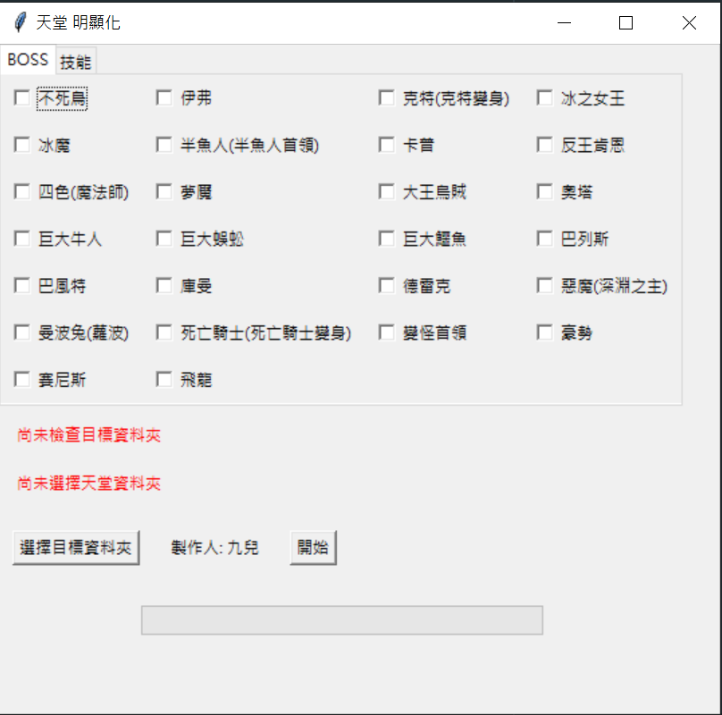

# BOSS明顯化

## 簡介
BOSS明顯化是一款便於管理和顯化BOSS文件的工具。使用者可以通過選擇一個目標資料夾並勾選需要顯化的BOSS項目，軟體將自動將顯化的檔案複製到選定的目標資料夾中。此工具旨在簡化BOSS文件的管理過程，使其更直觀和高效。

## Demo

## 功能
- 選擇目標資料夾
- 勾選需要顯化的BOSS項目
- 自動將顯化的檔案複製到目標資料夾
- 支援未來功能擴展（更新速度較慢）

## 安裝
請按照以下步驟安裝BOSS明顯化：

1. 前往 [BOSS明顯化 GitHub Releases](https://github.com/imHui77/lineageBoss/releases) 頁面。
2. 下載最新版本的安裝檔案 (`.exe`格式)。
3. 下載完成後，雙擊運行安裝檔案，按照提示完成安裝。

## 使用
1. 啟動BOSS明顯化程式。
2. 選擇目標資料夾。
3. 在界面中勾選需要顯化的BOSS項目。
4. 點擊“啟動”按鈕，軟體將自動將選中的BOSS項目複製到目標資料夾中。

## 未來功能
我們計劃在未來版本中增加以下功能：
- [x] 技能明顯化

請注意，功能更新速度會較慢，敬請期待。

## 貢獻
歡迎對本軟體進行貢獻！如果您有任何改進建議或發現任何問題，請通過提交 pull request 或發送 issue 與我們聯繫。

# 免責聲明

本專案「lineageBoss」由 imHui77 以開源形式提供，僅供學術研究、個人學習及非營利用途。使用者在下載、安裝或使用本專案時，應自行承擔所有風險，作者不對因使用本專案所造成的任何直接、間接、附帶或衍生的損害負責，包括但不限於資料遺失、系統損壞以及任何形式的財產損失。

本專案不保證其功能完整性、適用性或安全性，亦不承諾持續維護或更新。使用者應自行判斷本專案是否符合自身需求，並在必要時採取相應防護措施。

如有任何第三方資源或程式碼引用，相關權利歸原作者所有，使用者需遵守其授權條款。

**使用本專案即表示您已閱讀、理解並同意本免責聲明之所有內容。**